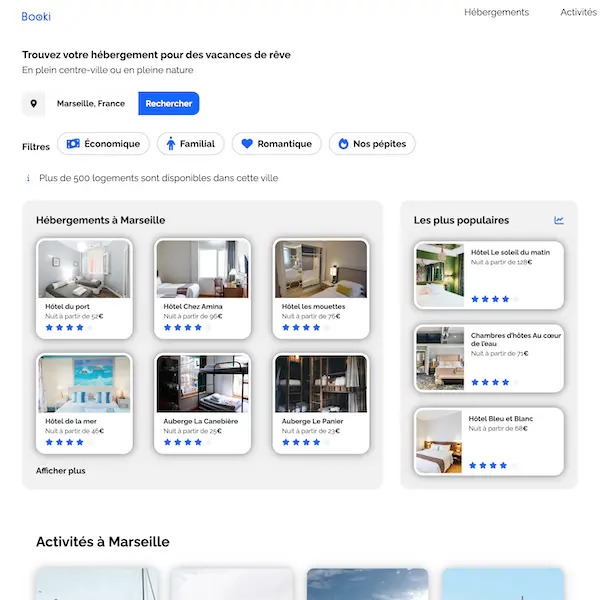

## Booki - Projet de soutenance n°3 de la formation Développeur Intégrateur Web

Dans ce projet, j'ai été chargé de créer la page d'accueil d'une agence de voyage en utilisant HTML et CSS. Ma mission principale était d'intégrer l'interface responsive du site, en m'appuyant sur les maquettes Figma fournies pour mobile, tablette et desktop. J'ai également utilisé les images et une note de synthèse sur les spécificités du projet pour créer mes propres composants d'interface et obtenir un rendu conforme à la maquette.

- HTML 5
- CSS 3

## Booki - Projet de soutenance n°3 de la formation Développeur Intégrateur Web

Dans ce projet, j'ai été chargé de créer la page d'accueil d'une agence de voyage en utilisant HTML et CSS. Ma mission principale était d'intégrer l'interface responsive du site, en m'appuyant sur les maquettes Figma fournies pour mobile, tablette et desktop. J'ai également utilisé les images et une note de synthèse sur les spécificités du projet pour créer mes propres composants d'interface et obtenir un rendu conforme à la maquette.

- HTML 5
- CSS 3